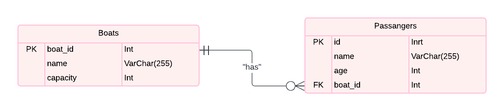
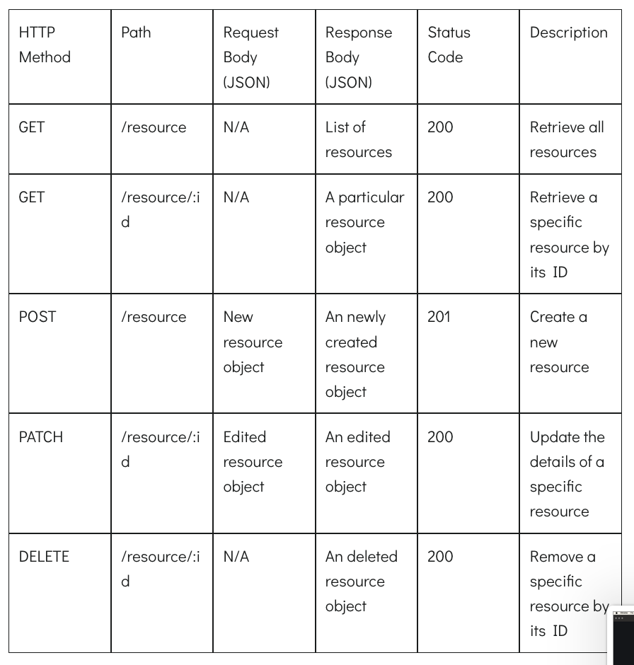

## Installation

Follow these steps to set up the project on your local machine.

### Installing Node.js

1. **Download Node.js**: Visit the [Node.js official website](https://nodejs.org/) and download the latest version suitable for your operating system.
2. **Install Node.js**: Run the downloaded installer and follow the prompts to complete the installation.

### Installing npm

npm (Node Package Manager) is automatically installed with Node.js. To verify that npm is installed, run the following command in your terminal:

```sh
npm -v
```

You should see the version number of npm displayed.

### Installing Packages

Navigate to the root directory of your project in your terminal and run the following command to install the necessary packages:

```sh
npm install
```

This will install all the dependencies listed in your `package.json` file.

### Install Postman or Insomnia API Viewers

For testing and interacting with your API, you can use tools like Postman or Insomnia.

- [Postman Download](https://www.postman.com/downloads/)

## Running the Project

To start the project, run the following command in your terminal:

```sh
npm run dev
```

## Entity-Relationship Diagram

The following Entity-Relationship Diagram (ERD) shows how the various entities in the project are linked together.

![ERD Diagram] 

> **Note:** Replace `path/to/your/erd-diagram.png` with the actual path to your ERD diagram image.


